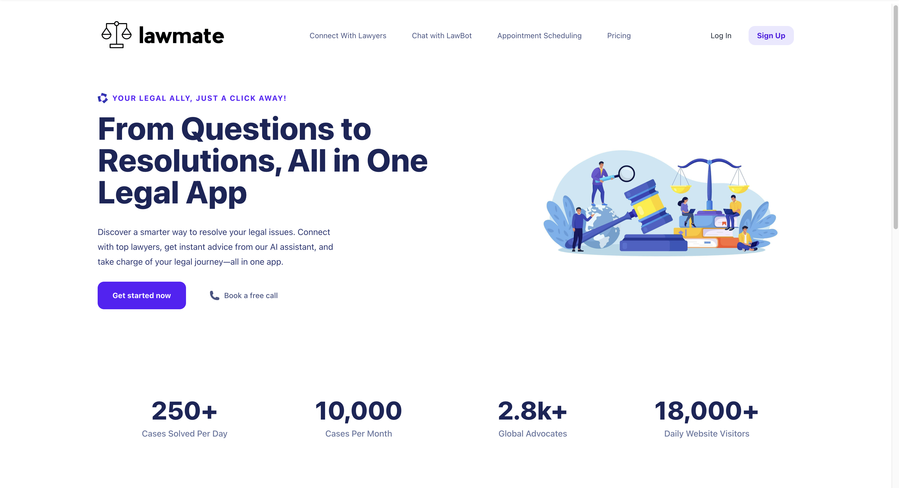
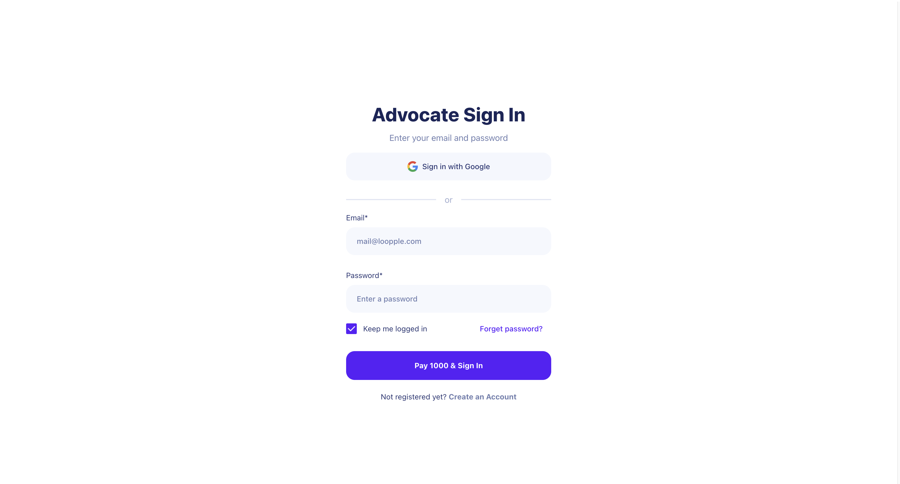
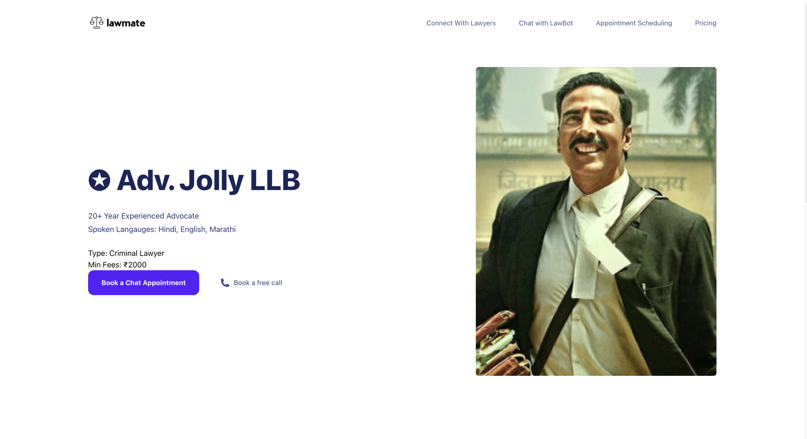
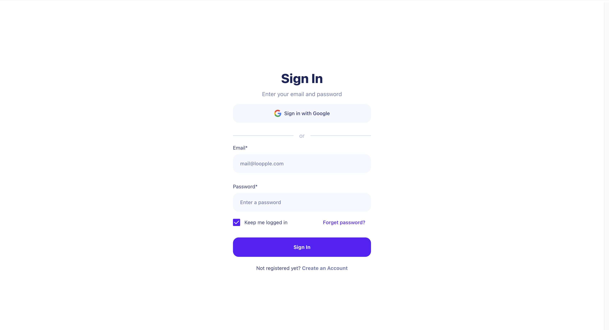
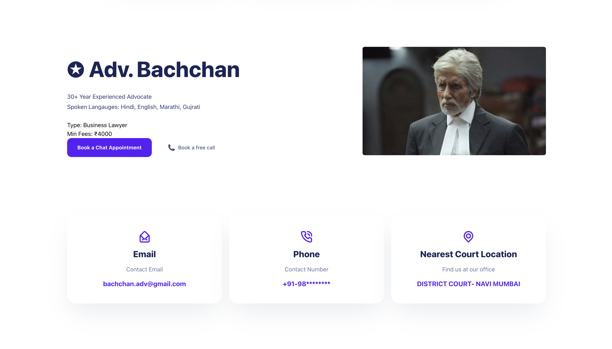
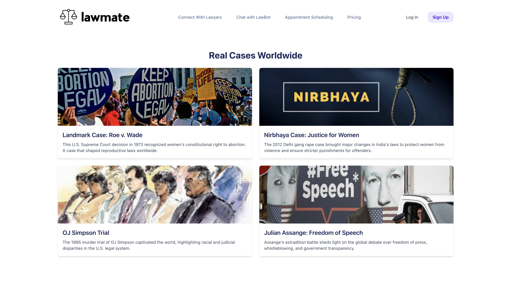
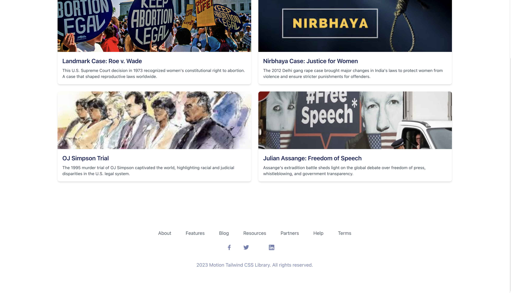
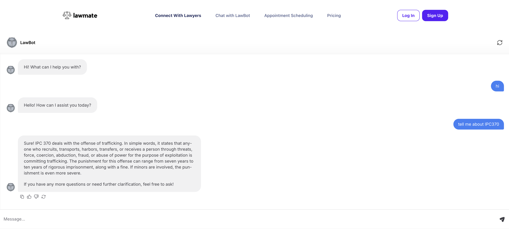
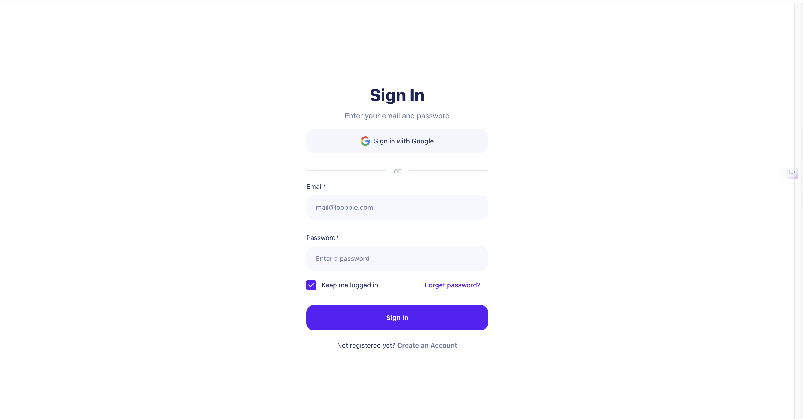

# Online Lawyer Consultation Website
## Website Url: https://www.loopple.com/preview/project-VU0ne360Trh1FEIL3A1Nap6D6MD34IBc79U?show=true
## User Login: https://www.loopple.com/preview/project-VU0ne360Trh1FEIL3A1Nap6D6MD34IBc79U?show=true&page=page2
## Chat Bot: https://www.loopple.com/preview/project-VU0ne360Trh1FEIL3A1Nap6D6MD34IBc79U?page=page3&show=true
## Advocate List: https://www.loopple.com/preview/project-HhSDP7RkRR7SOkWZpVUeaAQ66V22V9Am1no?show=true
## Advocate Login: https://www.loopple.com/preview/project-HhSDP7RkRR7SOkWZpVUeaAQ66V22V9Am1no?page=page2&show=true
## Blog: https://www.loopple.com/preview/project-HhSDP7RkRR7SOkWZpVUeaAQ66V22V9Am1no?page=page3&show=true

This project is an online lawyer consultation website built using the no-code platform Loopple. The website allows users to connect with lawyers, schedule appointments, and access various legal resources.

## Project Structure

The project has the following structure:

## Screenshots and Explanations

### 1. Home Page

The home page provides an overview of the services offered by the website. It includes sections for connecting with lawyers, booking appointments, and accessing legal resources.

### 2. Lawyer Login Page

The lawyer login page allows lawyers to sign in to their accounts. It includes fields for email and password, as well as options for signing in with Google.

### 3. Lawyer Profile Page

The lawyer profile page displays information about individual lawyers, including their experience, languages spoken, and contact details. Users can book a free call or chat appointment with the lawyer.

### 4. Blog Page

The blog page features articles on various legal topics. Each blog post includes an image, title, and a brief description.

### 5. Chat Page

The chat page allows users to chat with a legal chatbot for basic legal queries. It also provides options for connecting with lawyers and scheduling appointments.

### 6. User Login Page

The user login page allows users to sign in to their accounts. It includes fields for email and password, as well as options for signing in with Google.

## How to Run the Project

1. Clone the repository.
2. Open the `index.html` file in your browser to view the home page.
3. Navigate to other pages using the links provided on the home page.

## Technologies Used

- Loopple (No-code platform)
- Chatbase.co (Ai Model)
